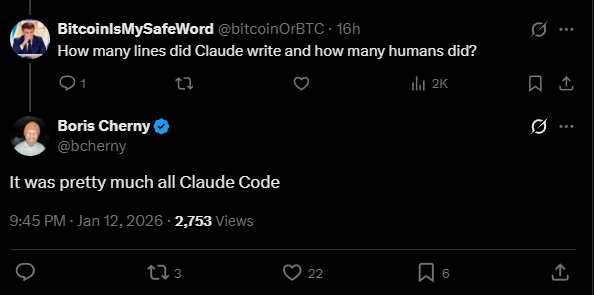

# AI Coding的工程造价：瓶颈从代码实现转移到质量控制

**几乎所有工程问题都可以换成造价问题。** 传统软件工程的最佳实践，都是在高人力成本约束下的优化方案。AI 把工程的造价结构彻底改变了。

---

## 写代码：下降两个数量级

Anthropic刚刚发布的[Claude Cowork](https://claude.com/blog/cowork-research-preview)，一个完整的桌面应用产品，从零到发布只用了一周半。有人问Claude Code的发明者Boris Cherny：人写了多少代码，Claude写了多少？

全是AI写的。

更夸张的是，Cherny透露Claude Code自己的代码库，80%是Claude Code自己写的。到2025年12月，他整整一个月没打开IDE，Claude一个月写了大约200个PR，每一行代码都是AI产出的。

我自己的体验：一个完整的API adapter模块，以前估计需要2-3周开发时间。现在Claude Code一下午写完初版，我稍微把关。耗时从10个工作日变成1个工作日。我本人已经四个月没有写过代码了。

有零代码经验的运维朋友在群里互相吆喝：

一个支持多通道告警的监控系统。"练手"项目。五年前这是需要一个团队、做几个季度的产品规划。现在是随口一问——周末可能就能搞定的事。

即使维护老项目，要改20处引用？grep全改了就行。有回归测试在，没有不敢改的代码。

老思路是小心修改，保留能用的，尽量少动。这种思路来自高人力成本的年代。现在写代码便宜了，理性的做法反过来：大胆重写，充分测试。

## 写测试：从奢侈品变成标配

为了测试我的系统对接银行API，我写了个mock bank，模拟瑞典所有银行的API。为了验证mock bank本身是对的，又写了一套测试来测mock bank。
有趣的是，还真有这么一个商业 SaaS MockBank.io存在。 以前我可能要买SaaS，但是现在无非就是让AI顺便实现我要对接的API而已。

为了开发一个子系统，而去实现一个商业SaaS的MockBank，放在AI之前，我老板绝对不会批这个预算。现在我根本不需要预算。

2014年DHH宣布"TDD已死"，很多团队放弃了测试先行。当时有道理：实在太耗时了，投资回报不一定划算。现在写测试代码便宜，TDD又借尸还魂了。Kent Beck现在说TDD是和AI agent协作的"超能力"。

根据[SQLite官方文档](https://sqlite.org/testing.html)，SQLite测试代码和业务代码的比例是590:1。15.5万行业务逻辑，9200万行测试。以前这看起来是疯了。现在看起来也不是那么难以达到。

## 文档：接近零成本

传统文档写完就开始过时。代码变了，文档没变，文档变成谎言。所以大家干脆不写。

AI工具可以在代码变更时自动触发文档更新。维护成本趋近于零。

其实大多数文档已经不需要存在了——LLM直接读代码就行。

变得更有价值的是决策文档：为什么选这个方案，否决了哪些替代方案，接受了什么取舍。这些上下文不在代码里。在commit message、设计文档和对话记录里。

## MVP/原型：几个月 → 几小时

验证一个想法以前要花几万块钱、几个月工程时间。现在一百块钱加一个下午。

以前需要等工程团队三个月排期的Demo工作，现在销售团队可以直接做。从想法到验证的反馈循环从几个月压缩到几天。我一个销售同事很开心他不用做PPT了，用Lovable做个看得到的Demo比在PPT画饼还简单。

---

## 定义需求：还是那么难

AI能写代码，但不知道该写什么。AI能写测试，但不知道什么叫"通过"。

我的体验：写代码的时间大幅缩短。定义产品规格的时间没变。

定义需求所需要的上下文大多数是没有落在纸面的，AI根本无从获取。

## Code Review：成为新瓶颈

AI产出代码的速度远超人类review的速度。我的同事Marcus一天在Slack 频道里刷屏刷了二十个PR，要跟上他的节奏，得配个专职的代码审查员。

传统开发流中，写代码是瓶颈，review是检查点。现在反过来了。写代码不再是瓶颈。Review才是。人类review速度没变。要review的代码量暴增。同事崩溃掉了，问他："Marcus，你已经读过Claude生成的代码了，我再review有什么意义？我给你approve，你直接合并吧"

### 架构设计

AI懂设计模式。AI懂架构原则。AI能画漂亮的架构图。但AI是个软耳朵——张三要快它就快拔萝卜不洗泥，李四要好它就慢工出细活，完全没有一致的立场。

架构决策是在约束下做平衡：性能 vs 成本，灵活性 vs 复杂度，短期交付 vs 长期维护。没有一个标准答案。决策者需要计算风险、做出取舍。AI不会说"这个需求不合理，砍掉"。它只会想办法实现你说的一切。好的架构师会push back，而AI只会说：

## 利益相关方协调

我需要接入瑞典的银行，需要QWAC和QSEAL证书.技术集成被AI一下午写完。证书更新花了两个月，证书扩散花了一个月，和证书机构来回扯皮，等银行老爷回复邮件，和1996年没什么区别。

这个模式到处都是。安全审核。法务批准。合作伙伴协调。供应商合同。监管合规。大厂总是说“AI提效不明显”，无非就是这个原因。

---

## CI/CD：新的质量执行层

传统运维容忍模糊。安装手册过时、矛盾、不完整。有经验的工程师靠improvise——知道跳过哪些步骤、忽略哪些警告、先装哪些没写在文档里的依赖。隐性知识在人脑子里。

AI agent没有隐性知识。严格按指令执行。给AI一个有问题的部署脚本，它会自信地、反复地把事情搞砸。人类靠直觉绕过去的混乱，在规模化执行时变成灾难性故障。

CI/CD流水线把以前非正式的东西正式化。自动化测试、lint、安全扫描、staging部署、E2E验证——"什么叫正确"的显式规格。流水线就是契约。通过流水线，达到标准。

---

## 我的团队在探索什么

**TDD.** 我们严格区分两个subagents：tester只写测试用例，而coder只写业务逻辑。每个需求或者bugfix，都从测试代码开始写。对人来说极为痛苦的一个流程，对AI来说，根本不算事。

**铁三角团队.** 

我们借鉴了[Hemnet 的产品三角团队概念](https://career.hemnet.se/posts/product-trio-to-speed-up-product-discovery)，发明了 AITrio：产品负责人、主程、质量控制。

产品负责人定义需求和验收标准——什么叫"完成"。主程和AI配合生成和迭代代码。质量控制验证产出是否符合规格，维护测试基础设施。
瓶颈是规格清晰度和质量保证。分离角色强制显式交接：

产品负责人必须把需求和验收标准表达得足够清楚，让工程师+AI能把需求翻译成代码，让质量控制把验收标准翻译成测试用例。

**基于PRD的快速迭代。** 前置文档。编码之前写详细PRD看起来很老派——瀑布思维。

模糊的PRD意味着开发者在实现过程中用自己的判断填补空白。以前行得通，因为好的开发者可以使用自己的常识补充PO的懒惰。现在AI用它的判断填补空白，经常以微妙的方式出错。精确的PRD，翻译成测试用例，成为AI迭代的规格。迭代周期从几周缩短到一两天：PRD → 测试 → AI生成代码 → 测试失败 → AI修复 → 测试通过 → 人工检查。

**重新思考code review。** 

传统code review有多重目的：抓bug、知识传递、执行标准。当AI生成代码，有些目的变得多余（AI不需要知识传递），有些变得更重要（人类验证AI理解了意图）。

这些都还没定论。老剧本优化的是写代码贵、人力注意力便宜的世界。那个世界没了。

如果你也在做类似的实验，我想听听什么有效——尤其是如果你觉得我说错了。
