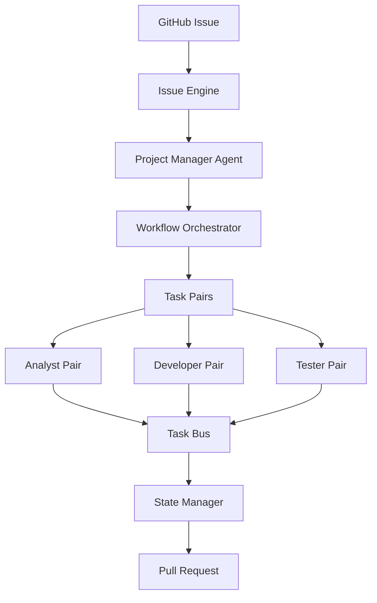

# AI Coding Team - Multi-Agent System Architecture

## Executive Summary

This architecture defines a sophisticated multi-agent system that processes GitHub issues through a structured workflow involving specialized agents working in pairs, with built-in quality control and iteration cycles.

## System Overview



## Core Architecture Components

### 1. Issue Ingestion Layer

```typescript
interface IssueIngestion {
  // Entry point for all issues
  receiveIssue(webhookPayload: GitHubIssue): Promise<WorkflowInstance>
  
  // Issue classification
  classifyIssue(issue: GitHubIssue): IssueType
  
  // Initial validation
  validateIssue(issue: GitHubIssue): ValidationResult
}

enum IssueType {
  BUG_FIX = "bug_fix",
  FEATURE = "feature",
  STORY = "story",
  TROUBLESHOOTING = "troubleshooting",
  REFACTOR = "refactor"
}
```

### 2. Workflow Orchestration Engine

```typescript
interface WorkflowEngine {
  // Core workflow management
  createWorkflow(issue: GitHubIssue): Workflow
  executeTask(task: Task): Promise<TaskResult>
  transitionState(workflowId: string, newState: WorkflowState): void
  
  // Task coordination
  assignTaskPair(task: Task): TaskPair
  handleTaskCompletion(taskId: string, result: TaskResult): NextAction
}

enum WorkflowState {
  TODO = "TODO",
  ANALYZING = "ANALYZING",
  PLANNING = "PLANNING",
  DEVELOPING = "DEVELOPING",
  TESTING = "TESTING",
  REVIEWING = "REVIEWING",
  ITERATING = "ITERATING",
  COMPLETED = "COMPLETED",
  FAILED = "FAILED"
}
```

### 3. Agent Framework

#### 3.1 Project Manager Agent

```typescript
interface ProjectManagerAgent {
  // Planning capabilities
  analyzeIssue(issue: GitHubIssue): IssueAnalysis
  createTaskBreakdown(analysis: IssueAnalysis): Task[]
  prioritizeTasks(tasks: Task[]): Task[]
  
  // Decision making
  determineNextTask(workflow: Workflow): Task | null
  evaluateTaskResult(result: TaskResult): Decision
  handleBlocker(blocker: Blocker): Resolution
  
  // Monitoring
  assessProgress(workflow: Workflow): ProgressReport
  identifyRisks(workflow: Workflow): Risk[]
}
```

#### 3.2 Task Executor Agents (Taskers)

```typescript
interface AnalystAgent {
  gatherRequirements(issue: GitHubIssue): Requirements
  analyzeCodebase(context: CodeContext): Analysis
  createDocumentation(analysis: Analysis): Documentation
  identifyDependencies(requirements: Requirements): Dependency[]
}

interface DeveloperAgent {
  implementSolution(task: DevelopmentTask): Implementation
  refactorCode(feedback: Feedback): Implementation
  fixBug(bug: BugReport): BugFix
  optimizePerformance(metrics: PerformanceMetrics): Optimization
}

interface TesterAgent {
  generateTestCases(requirements: Requirements): TestCase[]
  writeUnitTests(implementation: Implementation): UnitTest[]
  writeIntegrationTests(components: Component[]): IntegrationTest[]
  validateImplementation(impl: Implementation, requirements: Requirements): ValidationResult
}
```

#### 3.3 Navigator Agent (Quality Partner)

```typescript
interface NavigatorAgent {
  // Review capabilities
  reviewCode(implementation: Implementation): ReviewResult
  validateArchitecture(design: Design): ArchitectureReview
  checkTestCoverage(tests: Test[]): CoverageReport
  
  // Guidance
  provideFeedback(work: Work): Feedback
  suggestImprovements(implementation: Implementation): Suggestion[]
  ensureStandards(code: Code): StandardsReport
  
  // Iteration management
  determineIfIterationNeeded(review: ReviewResult): boolean
  guideIteration(feedback: Feedback): IterationGuidance
}
```

### 4. Task Pair System

```typescript
interface TaskPair {
  tasker: TaskerAgent  // Analyst, Developer, or Tester
  navigator: NavigatorAgent
  task: Task
  iterations: Iteration[]
  
  // Execution
  execute(): Promise<TaskResult>
  iterate(feedback: Feedback): Promise<TaskResult>
  
  // Communication
  exchangeMessages(message: Message): void
  synchronize(): void
}

interface Iteration {
  number: number
  input: TaskInput
  output: TaskOutput
  feedback: Feedback
  improvements: Improvement[]
  status: IterationStatus
}
```

### 5. Task Definition System

```typescript
interface Task {
  id: string
  type: TaskType
  input: TaskInput
  expectedOutput: OutputSchema
  acceptanceCriteria: Criteria[]
  maxIterations: number
  timeout: number
  dependencies: TaskDependency[]
}

interface TaskInput {
  context: Context
  requirements: Requirements
  previousTaskOutputs: TaskOutput[]
  constraints: Constraint[]
}

interface TaskOutput {
  result: any
  artifacts: Artifact[]
  metrics: Metrics
  nextTaskRecommendation?: string
}
```

### 6. State Management

```typescript
interface StateManager {
  // Workflow state
  workflows: Map<string, WorkflowState>
  
  // Task states
  tasks: Map<string, TaskState>
  
  // Agent states
  agents: Map<string, AgentState>
  
  // State transitions
  transitionWorkflow(workflowId: string, newState: WorkflowState): void
  transitionTask(taskId: string, newState: TaskState): void
  
  // State queries
  getWorkflowHistory(workflowId: string): StateTransition[]
  getCurrentTasks(workflowId: string): Task[]
  getBlockedTasks(): Task[]
}
```

### 7. Communication Bus

```typescript
interface CommunicationBus {
  // Message passing
  sendMessage(from: Agent, to: Agent, message: Message): void
  broadcast(message: Message): void
  
  // Event handling
  publishEvent(event: SystemEvent): void
  subscribeToEvents(agent: Agent, eventTypes: EventType[]): void
  
  // Data sharing
  shareArtifact(artifact: Artifact): void
  requestData(dataType: DataType): Promise<Data>
}
```

## Workflow Execution Flow

### Phase 1: Issue Analysis
```
1. GitHub Issue received
2. PM Agent analyzes issue
3. PM creates task breakdown
4. PM prioritizes tasks
5. Workflow initialized with TODO state
```

### Phase 2: Task Execution
```
For each task:
1. PM assigns task to appropriate pair
2. Tasker begins work
3. Navigator reviews continuously
4. Iterations occur as needed
5. Task output validated
6. State transitions to next phase
```

### Phase 3: Quality Gates
```
At each transition:
1. Navigator validates output
2. Acceptance criteria checked
3. PM reviews progress
4. Decision made (proceed/iterate/fail)
```

## Implementation Architecture

### Technology Stack

```yaml
Core Framework:
  Language: TypeScript
  Runtime: Node.js 20+
  Framework: NestJS (for DI and modularity)

Agent Communication:
  Message Bus: Redis Pub/Sub
  State Store: Redis
  Event Streaming: Apache Kafka (future)

Persistence:
  Primary DB: PostgreSQL
  Document Store: MongoDB
  File Storage: S3-compatible

AI Integration:
  Primary: OpenAI GPT-4
  Secondary: Claude 3 (for validation)
  Embeddings: OpenAI Ada

Observability:
  Logging: Winston + ELK Stack
  Metrics: Prometheus
  Tracing: OpenTelemetry
  Monitoring: Grafana
```

### Directory Structure

```
/src
├── core/
│   ├── workflow/
│   │   ├── engine.ts
│   │   ├── orchestrator.ts
│   │   └── state-machine.ts
│   ├── communication/
│   │   ├── message-bus.ts
│   │   ├── event-publisher.ts
│   │   └── data-sharing.ts
│   └── persistence/
│       ├── state-manager.ts
│       └── artifact-store.ts
├── agents/
│   ├── project-manager/
│   │   ├── analyzer.ts
│   │   ├── planner.ts
│   │   └── decision-maker.ts
│   ├── taskers/
│   │   ├── analyst/
│   │   ├── developer/
│   │   └── tester/
│   └── navigator/
│       ├── reviewer.ts
│       ├── validator.ts
│       └── guide.ts
├── pairs/
│   ├── pair-executor.ts
│   ├── iteration-manager.ts
│   └── synchronizer.ts
├── tasks/
│   ├── task-factory.ts
│   ├── task-validator.ts
│   └── task-templates/
└── integrations/
    ├── github/
    ├── openai/
    └── monitoring/
```

## Agent Interaction Patterns

### 1. Task Assignment Pattern
```
PM → Workflow Engine → Task Pair Assignment → Execution
```

### 2. Iteration Pattern
```
Tasker → Work → Navigator → Review → Feedback → Tasker → Rework
```

### 3. Quality Gate Pattern
```
Task Output → Navigator Validation → PM Review → State Transition
```

### 4. Communication Pattern
```
Agent → Message Bus → Target Agent(s)
Agent → Event → All Subscribers
```

## Data Flow

### Input Processing
```
GitHub Issue → Classification → Requirements Extraction → Task Generation
```

### Task Execution
```
Task Input → Agent Processing → Artifact Generation → Output Validation
```

### Output Generation
```
Validated Artifacts → Code Assembly → PR Creation → Issue Update
```

## Quality Assurance

### Code Quality Checks
- Syntax validation
- Style conformance
- Security scanning
- Performance analysis
- Test coverage

### Process Quality
- Task completion criteria
- Iteration limits
- Timeout handling
- Error recovery
- Rollback capability

## Scalability Considerations

### Horizontal Scaling
- Agent pools for parallel execution
- Task queue distribution
- Load balancing across pairs

### Performance Optimization
- Caching of agent decisions
- Reuse of analysis results
- Batch processing capabilities

### Fault Tolerance
- Agent health monitoring
- Automatic recovery
- Task retry logic
- State persistence

## Security Architecture

### Access Control
- Agent authentication
- Role-based permissions
- Secure communication channels

### Data Protection
- Encryption at rest
- Encryption in transit
- Secrets management
- Audit logging

## Monitoring & Observability

### Key Metrics
```yaml
Workflow Metrics:
  - Issues processed per hour
  - Average completion time
  - Success/failure rates
  - Iteration counts

Agent Metrics:
  - Task execution time
  - Error rates
  - Resource utilization
  - Response times

Quality Metrics:
  - Code review pass rate
  - Test coverage
  - Bug escape rate
  - PR acceptance rate
```

### Dashboards
- Real-time workflow status
- Agent performance
- System health
- Quality trends

## Migration Strategy

### Phase 1: Foundation (Week 1-2)
1. Set up core workflow engine
2. Implement state management
3. Create communication bus
4. Deploy PM agent

### Phase 2: Basic Agents (Week 3-4)
1. Implement Analyst agent
2. Implement Developer agent
3. Create Navigator agent
4. Test pair execution

### Phase 3: Advanced Features (Week 5-6)
1. Add Tester agent
2. Implement iteration logic
3. Add quality gates
4. Enable full workflow

### Phase 4: Production Ready (Week 7-8)
1. Add monitoring
2. Implement error handling
3. Performance optimization
4. Documentation

## Success Criteria

### Functional
- ✅ All issue types handled
- ✅ Multi-iteration support
- ✅ Quality validation
- ✅ Automated PR creation

### Performance
- ✅ < 5 min average resolution
- ✅ > 90% first-pass success
- ✅ < 3 iterations average
- ✅ 100% test coverage

### Quality
- ✅ No broken builds
- ✅ Clean code standards
- ✅ Comprehensive tests
- ✅ Clear documentation

## Risk Mitigation

### Technical Risks
- **Agent hallucination**: Multiple validation layers
- **Infinite loops**: Iteration limits and timeouts
- **State corruption**: Transaction boundaries and rollback

### Operational Risks
- **Cost overrun**: Token limits and caching
- **Performance degradation**: Auto-scaling and optimization
- **System failure**: Graceful degradation and recovery

## Conclusion

This architecture provides a robust, scalable foundation for a multi-agent AI coding team that can reliably process GitHub issues with high quality output through structured workflows, pair programming patterns, and built-in quality controls.

The system is designed to be implemented incrementally, allowing for validation and refinement at each phase while maintaining backward compatibility with existing GitHub integrations.