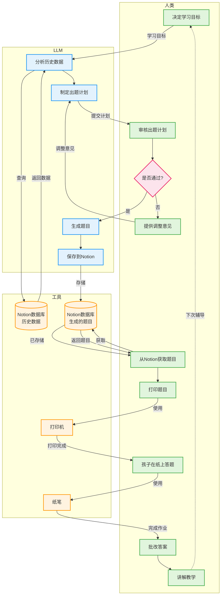

# 数学辅导协作流程图 - 泳道视图

此图展示了人类、LLM和工具之间的分工协作。

```mermaid
graph 
    subgraph Human["人类"]
        H1[决定学习目标]
        H2[审核出题计划]
        H3{是否通过?}
        H4[提供调整意见]
        H5[从Notion获取题目]
        H6[打印题目]
        H7[孩子在纸上答题]
        H8[批改答案]
        H9[讲解教学]
    end

    subgraph LLM["LLM"]
        L1[分析历史数据]
        L2[制定出题计划]
        L3[生成题目]
        L4[保存到Notion]
    end

    subgraph Tools["工具"]
        T1[(Notion数据库<br/>历史数据)]
        T2[(Notion数据库<br/>生成的题目)]
        T3[打印机]
        T4[纸笔]
    end

    H1 -->|学习目标| L1
    L1 -->|查询| T1
    T1 -->|返回数据| L1
    L1 --> L2
    L2 -->|提交计划| H2
    H2 --> H3
    H3 -->|否| H4
    H4 -->|调整意见| L2
    H3 -->|是| L3
    L3 --> L4
    L4 -->|存储| T2
    T2 -->|已存储| H5
    H5 -->|获取| T2
    T2 -->|返回题目| H5
    H5 --> H6
    H6 -->|使用| T3
    T3 -->|打印完成| H7
    H7 -->|使用| T4
    T4 -->|完成作业| H8
    H8 --> H9
    H9 -.->|下次辅导| H1

    classDef humanStyle fill:#e1f5dd,stroke:#4caf50,stroke-width:2px
    classDef llmStyle fill:#e3f2fd,stroke:#2196f3,stroke-width:2px
    classDef toolStyle fill:#fff3e0,stroke:#ff9800,stroke-width:2px
    classDef decisionStyle fill:#fce4ec,stroke:#e91e63,stroke-width:2px

    class H1,H2,H4,H5,H6,H7,H8,H9 humanStyle
    class L1,L2,L3,L4 llmStyle
    class T1,T2,T3,T4 toolStyle
    class H3 decisionStyle
```

## 关键要点

**人类（绿色）：**
- 战略决策（学习目标）
- 质量控制（审核批准）
- 教学辅导

**LLM（蓝色）：**
- 数据分析（历史表现）
- 计划制定（出题策略）
- 内容生成（生成题目）

**工具（橙色）：**
- 存储（Notion数据库）
- 物理输出（打印机、纸笔）
