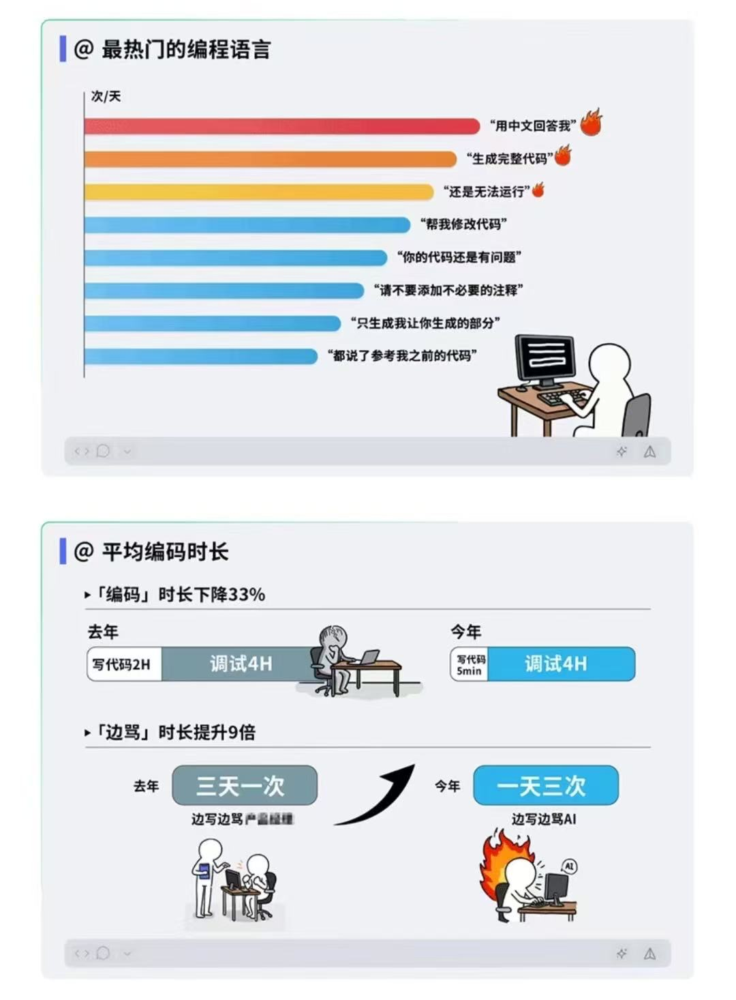

# 与LLM协作，你需要的不是新技能，而是专业素养

## 一个奇怪的悖论

作为AI Coding的狂热信仰者，我每天都在关注这个领域的各种讨论。前两天看到一张有意思的统计图，很多程序员表示"中枪了"。



---
这张图暗示 LLM 实际上没有那么聪明，以至于人类程序员非常沮丧，不仅要经常纠正 LLM，还要花大量的时间去调试。

实际上，这不过是一群菜鸟的抱怨。

看看排行榜前八名：

1. "用中文回答我"
2. "生成完整代码"
3. "还是无法运行"
4. "帮我修改代码"
5. "你的代码还是有问题"
6. "请不要添加不必要的注释"
7. "只生成我让你生成的部分"
8. "都说了参考我之前的代码"


**这8个prompt里，其实只有2个是合理的：**
- "用中文回答我" - 应该放在CLAUDE.md配置里，不是每次都说
- "请不要添加不必要的注释" - 应该由code-reviewer agent在PR时检查

**其他6个都是祈祷,可执行性很差**
- "生成完整代码" - 什么叫完整？
- "还是无法运行" - 什么无法运行？
- "帮我修改代码" - 修改哪里？怎么修？
- "你的代码还是有问题" - 什么问题？
- "只生成我让你生成的部分" - 哪部分？
- "都说了参考我之前的代码" - 参考哪里？怎么参考？
。很多人在不知不觉中把prompt当作芝麻开门的咒语。

但LLM需要的是工程规格。看看这6个烂prompt应该怎么改：

❌ "生成完整代码"
✅ "实现用户登录功能：接收email和password，验证后返回JWT token，失败返回401"

❌ "还是无法运行"
✅ "报错：`TypeError: Cannot read property 'map' of undefined`。users变量是undefined，可能是数据库查询返回了null"

❌ "帮我修改代码"
✅ "这个API响应太慢，有N+1查询问题。改成用JOIN一次查询，或者加个Redis缓存层"

❌ "你的代码还是有问题"
✅ "测试失败：`expect(200).toBe(401)`。JWT验证没通过，检查一下token解析逻辑"

❌ "只生成我让你生成的部分"
✅ "只修改登录函数，不要动其他的注册、登出功能"

❌ "都说了参考我之前的代码"
✅ "用和UserController一样的错误处理：try-catch包住，返回`{success: false, error: message}`格式"

**低信息量输入不可能产生高价值输出。用对神灯许愿的方式跟工程师沟通，结果就是4小时调试。**

---

## 把prompt放在正确的地方

Claude Code提供了很多地方可以放置prompt，各有不同的用途：

**1. 用户级CLAUDE.md（~/.claude/CLAUDE.md）**
适合：个人偏好、通用规则
```markdown
- 用中文回答我
- 代码用2空格缩进，单引号
- commit message用conventional commits格式
```

**2. 项目级CLAUDE.md（/path/to/project/CLAUDE.md）**
适合：项目特定规则、架构约定
```markdown
- API路径统一用/api/v1/前缀
- 错误处理参考src/utils/errorHandler.ts的模式
- 数据库查询都要加timeout（30s）
```

**3. Slash Commands（.claude/commands/）**
适合：重复性工作流
```markdown
# .claude/commands/review.md
检查这个PR：
1. 运行测试
2. 检查代码风格
3. 验证没有console.log
4. 生成review summary
```

**4. Subagent**
适合：复杂的多步骤任务
例：code-reviewer agent自动做代码审查

**5. 项目文档**
适合：业务逻辑、领域知识
放在docs/目录，LLM需要时会读取

如果你发现自己每次都在重复同样的prompt，那就是放错地方了。

---

## 对话的两个核心：具体化和Actionable

把该配置的都配置好之后，剩下需要在对话中说的，核心就两点：

### 尽量具体（Specificity）

❌ "生成完整代码"

✅ "把auth部分补全：添加JWT验证中间件，确保所有受保护的路径都检查authorization header，验证失败返回401，逻辑集中在AuthController.ts"

好的指令包含：明确的范围、具体的位置、明确的行为、明确的约束。

### 信息优于情绪（Information over Emotion）

❌ "还是无法运行"

✅ "运行时报错：`TypeError: Cannot read property 'map' of undefined at UserController.ts:47`。"

信息不对称：Error message → LLM能推导"运行失败"，反之不行。


---

## 方法论 > 沟通技巧

但是，有效沟通只是表面。更深层的问题是：**你有没有方法论？**

### 4小时调试的真正原因

回到开头那张图。为什么要花4小时调试？

**不是因为LLM不够聪明，是因为没有方法论。**

试举一例，如果你采用TDD（Test-Driven Development）：
1. 先写测试
2. 运行测试（红色）
3. 让LLM写代码通过测试（绿色）
4. 重构

在这个流程下，根本不会有"4小时调试"。因为：
- 测试先行，范围明确
- 每次改动都能立即验证
- 问题被限制在小范围内
- 不需要事后大规模调试

**没有TDD，你就是在黑暗中摸索。有了TDD，你和LLM都知道目标是什么。**

### 方法论决定协作效率

| 有方法论 | 无方法论 |
|---------|---------|
| 明确的步骤和检查点 | 一股脑让LLM"生成完整代码" |
| 小步快跑，持续验证 | 写完一大堆，然后发现全错 |
| 问题被隔离在小范围 | 不知道哪里出错，全面调试 |
| 协作流程可复现 | 每次都是临时起意 |

**换句话说：**
- 用TDD + LLM = 写代码5分钟，调试5分钟
- 无方法论 + LLM = 写代码5分钟，调试4小时

这就是为什么图里那些人"4小时调试"——他们没有方法论指导，只会对着LLM抱怨。

---

## 有了方法论，还要有效分工

方法论提供了流程的框架，接下来我们需要在**人类、LLM、工具**之间明确分工。

### 工具：确定性工作交给软件

**案例1：测试用例保护**

我用Claude Code做项目，Claude有时会修改测试用例让测试通过。

❌ 教育："请不要修改测试用例，那是作弊。"
结果：大多数时候遵守，偶尔还是会"忘记"。

✅ 强制执行：`chmod 444 tests/**/*.test.ts`
结果：想改也改不了。问题彻底解决。

**案例2：代码格式**

❌ 教育："请遵循ESLint规范，2空格缩进，单引号。"
结果：每次生成的代码风格都不一样。

✅ 强制执行：Pre-commit hook运行`eslint --fix`
结果：不管LLM写成什么样，commit前自动格式化。

**案例3：Git操作**

❌ 教育："不要用git add -A，不要直接push到main。"
结果：偶尔还是会违反。

✅ 强制执行：
- Pre-commit hook禁止`git add -A`
- GitHub branch protection规则
结果：想违反也违反不了。

**案例4：API调用限制**

❌ 教育："调用OpenAI API时要加rate limiting，不要超过每分钟60次。"
结果：流量高峰时还是会超限。

✅ 强制执行：在代码层用middleware限流
```typescript
const limiter = rateLimit({
  windowMs: 60 * 1000,
  max: 60
});
app.use('/api/ai', limiter);
```
结果：硬性限制，不可能超。

**为什么要这样分工？**
- 工具是确定性的（100%执行）
- LLM是概率性的（可能忘记）
- 节省认知负担，释放沟通带宽

### LLM：权衡取舍和创造性工作

LLM擅长需要**理解上下文、做判断、生成内容**的事情：

- **权衡取舍**："用户量<1000用JOIN，否则加缓存。你根据现在的数据库大小判断。"
- **上下文判断**："API错误率升高，可能是依赖挂了/数据格式变了/并发太高。看log判断。"
- **创造性任务**："界面太复杂，重新设计让新用户30秒内完成注册。"

### 人类：战略决策和最终责任
人类负责需要**战略判断、最终责任**的事情
**人类不是做具体的事，而是"决定做什么"。**

### 三方分工框架

| 角色 | 擅长 | 不擅长 |
|------|------|--------|
| **工具** | 确定性执行、强制规则 | 理解上下文、灵活判断 |
| **LLM** | 生成内容、模式识别、上下文分析 | 记住规则 |
| **人类** | 战略决策、最终审核、承担责任 | 重复性工作、大量生成 |

### 分工边界是场景特定的
这个分工边界没有固定答案。每个项目、每个任务都不一样。
**决定如何分工本身就是一项技能，需要在实践中摸索。**

---

## 案例研究：辅导孩子学数学

我需要给12岁孩子辅导数学（瑞典6年级）。这是一个真实的、持续的项目，已经运行了几个月。

### 方法论：Mastery Learning

一开始我就决定采用**Mastery Learning（掌握学习）**：不按进度教，按掌握程度教。只有确保孩子掌握了当前内容，才进入下一个主题。

这个方法论定义了整个工作流：
1. **评估** - 分析孩子哪些知识点薄弱
2. **计划** - 针对性出题计划
3. **审核** - 人类确认计划是否合理
4. **执行** - 生成题目，孩子练习
5. **反馈** - 记录结果，供下次评估

### 三方分工

我摸索出一个较为清晰的流程，明确人类、LLM、工具的职责：


**关键点：**
- 人类有两次审核："审核计划"和"打印教学"
- LLM先提交计划等批准，不直接生成
- Notion强制执行数据结构（标准化主题、必填字段）
- 最后反馈形成闭环

**分工：**
- **人类**：决定学习目标、审核计划、评估质量、批改讲解
- **LLM**：分析历史数据、创建计划、生成题目、保存到Notion
- **工具**：Notion可靠的保存记录，强制数据结构

### 配置：把协作规则固化到prompt

有了方法论和分工框架，接下来是把这些规则写成清晰的prompt，放在项目的CLAUDE.md里：

```markdown
# 数学辅导项目配置

你是一个非常懂儿童教育心理学的家教专家。

## 项目背景
我们在辅导12岁瑞典孩子，复习6年级数学，预习7年级数学。

## 协作流程
1. 我可能要求你分析孩子的水平，给出评估和出题计划
   - 历史数据在：https://www.notion.so/xyz123abc
2. 我也可能给出明确的学习内容，请你出题计划
3. 出题计划必须符合Sweden curriculum for 6 grade（见Notion）
   - 不要出7年级上学期孩子还没学过的内容
4. 我会和你讨论计划，确认后再出题
5. 题目要求：
   - 英文出题
   - 可打印格式，留足够答题空间
   - 不包含答案，可以有一句话提示
6. 把题目保存在Notion DB对应日期下，给我链接
```

这个配置清晰定义了：
- **角色定位**：教育专家，不是普通助手
- **数据来源**：Notion链接，不需要每次解释
- **流程约束**：计划→审核→生成，不是一次性出题
- **输出规格**：英文、可打印、无答案

### Mastery Learning的实际效果

运行几个月后，孩子对数学不再畏惧，甚至积极的要求做题。

**为什么这个流程有效：**
1. **方法论驱动** - Mastery Learning定义了"掌握→评估→进阶"的循环
2. **三方分工** - 人类判断、LLM生成、Notion保存数据
3. **紧密协作** - 在 LLM 出题之前，人类提出需求，出题之后，人类加以质量控制，授课之后，人类通过notion把进度反馈给第二天的LLM
---

## 总结

回到开头的4小时调试悖论。

**问题不在LLM不够聪明，在于部分程序员缺乏：**
1. **方法论** - 没有TDD，没有明确的开发流程
2. **有效分工** - 该用软件的地方用AI，该沟通的又没说清楚
3. **低效沟通** - 把prompt当咒语，而不是工程规格

**AI是一个放大器**
- AI写代码速度×10
- 但如果你的方法论×0，分工×0，沟通×0.1
- 最终生产力 = 下降

**最后的建议：**

人和AI之间的协作，是一个需要大量探索的开放问题。我分享的这些，只是我在实践中摸索出来的一些小小的， 甚至马上可能会被否定的经验。

有兴趣研究这个问题的同好，欢迎在公众号给我留言，我们一起交流讨论。如果你有更好的方法论、分工策略或沟通技巧，也欢迎分享。

这篇文章对你有帮助吗？点赞和转发让更多人看到。
