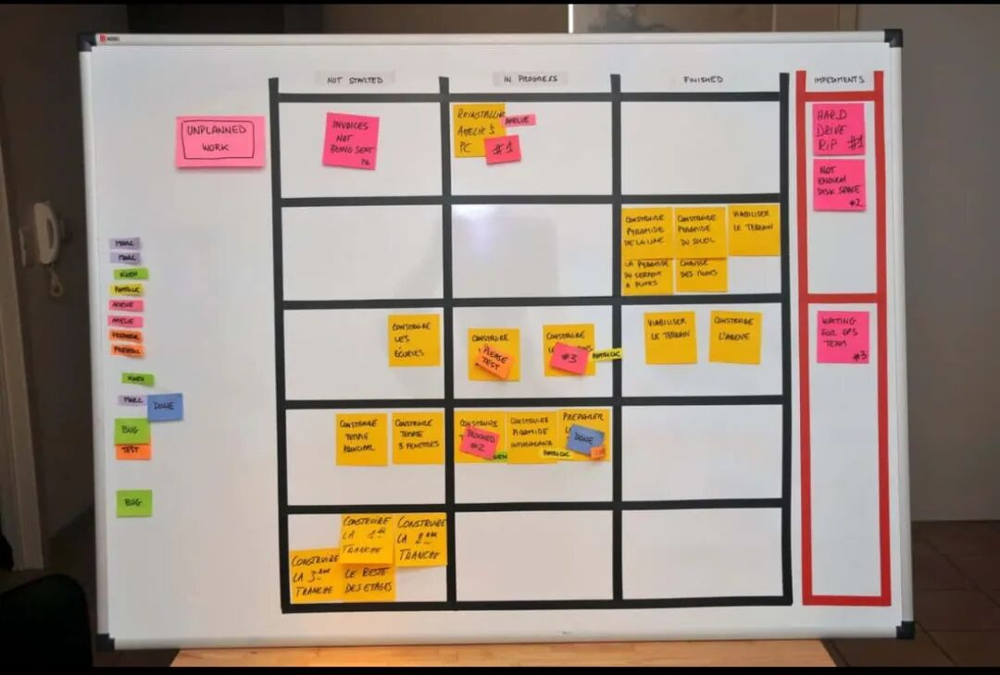

# 敏捷方法不适合AI Coding之一：信息不应该透明

**Original URL**: https://mp.weixin.qq.com/s/d-GpNGU97TUzljWG3qvxuA
**Author**: 马工在瑞典 / 瑞典马工
**Date**: 2026年2月5日 01:26

---

传统的敏捷软件开发范式非常鼓励信息透明，

Scrum把透明性视作其三大支柱之一， 强调

> The emergent process and work must be visible to those performing the work as well as those receiving the work. With Scrum, important decisions are based on the perceived state of its three formal artifacts.
> https://scrumguides.org/scrum-guide.html#transparency

比如，绝大多数敏捷团队都有一个看板系统，列举本小组的所有已完成和待完成任务。

每个成员都有权限去阅读，修改和领取每一个任务。有时候会有一些混乱，而敏捷方法论一定程度上拥抱甚至鼓励这种混乱。

时间快速进展到AI Coding时代。作为"把AI Agent当同事看待，不能当工具看"的坚定信仰者，我一直用仿生学方法，模拟人类社会的先进组织结构和工作流程，把他们搬运到我的 AI Agent组织。

但是在透明性这个方面，我拒绝模仿，并且有意的阻碍信息流动。下面我陈述下我的理由，和各位一起探讨。

## AI Agent缺乏决策力

每一个严肃的ai coding 实践者都经历过AI的这个特点。AI有丰富的博士级别的知识，但是它缺乏street smarts，经常做出一些很荒谬的决策。

低下决策力的一个来源是，AI 不太会给不同的信息赋予适当的权重。比如一个陷于debug很久而无法脱身的AI，急于完成任务，会说"我的上下文窗口快要耗尽了，这个bug解决不了，我已经这个测试用例删掉了"，然后开心的告诉你任务完成了。这就是典型的不分轻重。

敏捷鼓励信息透明，基于一个前提：背景信息越多，professionals做的决策质量越高。这个推断在AI可能是错的，你给它很多信息，并不能帮助它做更好的决定，只会消耗它的上下文。

## AI Agent很容易被操纵

可能出于训练出的天性，AI Agent过分的讨好用户，试图满足每一个需求，并没有自己的主见。而人类信息往往是冲突的，这时候，最后一片信息会得到过分的权重。

有一个前川普幕僚说川普的最后决定取决于谁向他说最后一句话，因此内阁每个人都想在最后一刻给他汇报。在这一点，AI Agent表现得就像现任美国总统。

那么，向AI Agent开放所有文档，那么谁向AI说最后一句话就是随机的了。如果我们有两份相冲突的历史设计文档，哪一份会影响AI的决策，就看缘分了。

## AI Agent很容易上下文过载

目前最大的上下文窗口Claude Sonnet 4.5 1M，在软件工程中，很容易触及。

而compact 作为一个绕过措施，表现很不稳定。

给AI Agent过多的信息，会恶化上下文膨胀。

## 随机信息不利于质量控制

信息透明意味着人类orchestrator放弃对AI Agent输入的严格控制，那么进而也就失去了对输入质量的控制。

以我的Coder subagent为例，它的输入是CLAUDE.md, architecture.md, task.md和代码库，输出是新代码和测试报告。经验证明，输出质量和输入质量有极为明显的因果关系。因此我在输入质量上投入的努力会得到非常直接的回报。

试想一下，如果Coder的输入还包括上下游tasks，包含历史设计文档，包含客户emails，那么我就不可能去审查这些artifacts 的质量了，也就是说，那么garbage in and garbage out就有了可能。

我有朋友不赞同我这种控制狂做法。他们认为这种做法实际上压抑了AI，把AI限制在我个人能力的天花板之下。黄东旭在试验一种"狂烧Token让一百个AI Agent自行摸石头过河，然后奖励第一个过河卒子"的模式。基于上面说的原因，我个人不走这种土豪路线，但是两种思路也许都有自己的适用场景。

---

读到这里，说明你对AI Coding真的很有兴趣。如果你愿意和我直接讨论，欢迎在微信公众号对话窗口给我发送一个消息。我真诚的期望看到
1.您的真实姓名（我认为匿名者没有任何诚意）。
2.您的AI Coding一手经验和观点。我拒绝和观察者交流，纯浪费时间。
3.如果您能指出一个您不同意的瑞典马工的观点，那就更好了。这说明我们在分别探索不同的路径，能够互相补益。

---

## Images
- 
