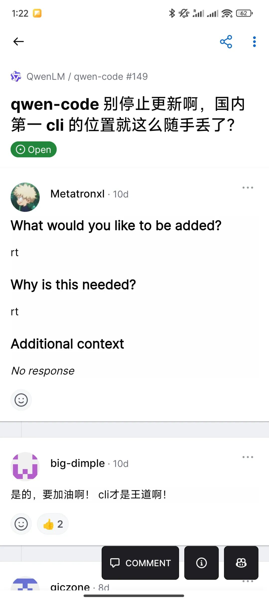

# 阿里的qwen code太草率了

**Original URL**: https://mp.weixin.qq.com/s/6WJei6N398JAY2C6nZ3mUQ
**Author**: 马驰 / 瑞典马工
**Date**: 2025年8月9日 01:47

---

阿里的qwen-code CLI是基于谷歌的Gemini CLI 分叉的。后者的开源协议是非常宽松的 Apache 2.0，所以阿里这样做，法律上完全没问题。

但是合规之外，还是有不少问题的。

用户体验上，就有用户反应工具的初始化命令生成的是谷歌Gemini模型需要的GEMINI.md，而不是qwen需要的QWEN.md。显然，这是fork的时候，检查不彻底导致的遗留。

> What happened?
> While exploring the CLI, I noticed that the /init command generates a GEMINI.md file.
> What did you expect to happen?
> The /init command should ideally generate a QWEN.md,
>
> https://github.com/QwenLM/qwen-code/issues/231

在这之外，产品管理也会有比较大的挑战。谷歌的这个项目虽然开源，但并不采用社区协作开发模式，基本不接受外部贡献。项目贡献榜前几名全都是谷歌员工。这就意味着，Gemini CLI必然不会照顾非谷歌大模型的需求。

在此前提下，qwen要么投入同等的资源维护一个完全不兼容的分叉，要么就忍声吞气跟着谷歌走。后者显然是不可接受的，而前者，就没达到节省成本的目的。

用户们也敏锐的发现阿里团队对qwen code不太积极维护了，他们甚至语带嘲讽的催促中国第一CLI别停止更新。

这就涉及到第三个问题，品牌形象问题。用户很自然的产生疑问，一个大公司把客户端软件建立于一个自己不可控的源头上，是不是意味着他们资源有限无法投入，或者不重视不愿意投入？

推特上这位老哥，就刻意翻出qwen code里提到Gemini的地方，用来怼qwen的宣传。可以看出，这位老哥并非qwen的竞争对手，他就是纯粹在较真抬杠。但是他有一点说得很到位

"如果你把Gemini CLI复制成qwen code，却连Gemini都没清理干净，我不会把你的雄心当作一回事。"

其实，Gemini CLI做的很烂，issue里全是bug report，都淹没了feature request。谷歌的大模型在编码领域也没有竞争力，没办法把这个很挫的CLI带成事实标准。qwen code 分叉它，相当于投胎凤姐然后再去整容，刻意走了一道弯路。

总而言之，从产品管理的角度，qwen code基于Gemini CLI分叉是一个很草率的决定。导致客户端的质量和qwen大模型的强劲竞争力不匹配。

如果阿里确实不想自己开发客户端（其实用上AI的话，也花不了多大的成本），干脆赞助一个社区主导的CLI，Open Code或者 Crush 都可以，选谁都比选Gemini CLI强。

---

## Images
- 
- 
