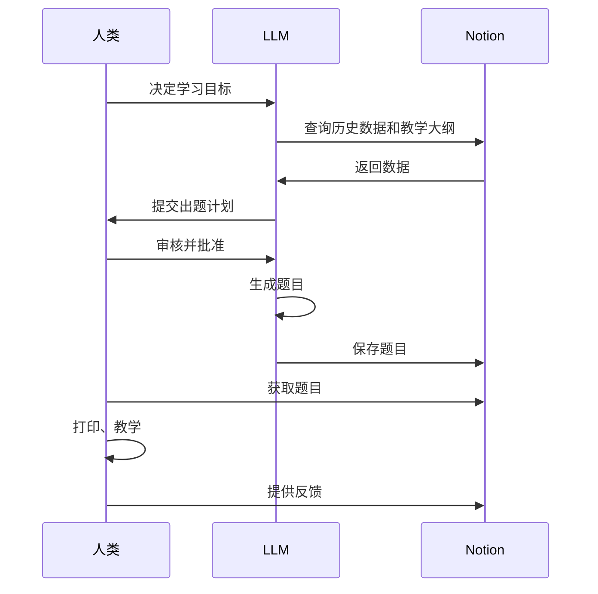

# 数学辅导协作流程图 - 顺序视图

此图展示了数学辅导的三阶段流程：计划制定、题目生成、教学学习。

## 三阶段流程

**阶段1：计划制定**
- 人类设定方向
- LLM分析数据并提出计划
- 人类进行质量控制

**阶段2：题目生成**
- LLM在约束条件下生成内容
- 工具存储和组织

**阶段3：教学学习**
- 人类获取、打印并教学
- 工具辅助物理学习
- 人类通过指导完成闭环
